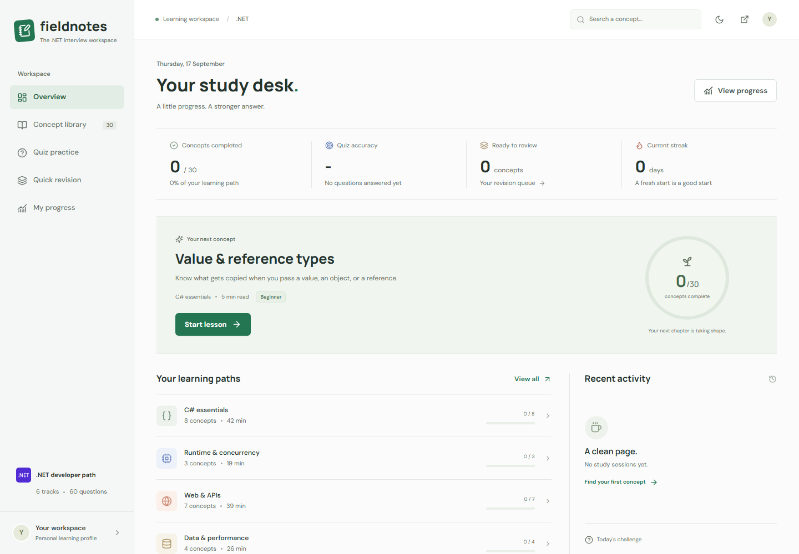

# Fieldnotes for .NET

A practical interview preparation workspace built with **.NET 10 and Blazor WebAssembly**, ready for **GitHub Pages**. The entire application runs in the browser: no backend server, hosted database, or API keys are required.

<picture>
  <source media="(prefers-color-scheme: dark)" srcset="docs/screenshots/overview-dark-desktop.png">
  
</picture>

## What's included

- **30 lessons across six paths**, with 60 quiz questions and 60 interview questions with model answers.
- Simple explanations, why and when to use each concept, practical use cases, small examples, realistic code excerpts, mistakes, good practices, and related concepts.
- Search, difficulty and learning-path filters, bookmarks, and completion tracking.
- Full lessons and quick notes, syntax-highlighted examples, and code copying.
- Short randomized quizzes with answer explanations, saved results, and repeat-submission protection.
- Flashcards with reveal, recall ratings, and spaced review dates.
- Dashboard, weak-topic recommendations, quiz accuracy, UTC study streaks, 28-day activity view, and study history.
- JSON progress export and persistent, isolated browser profiles.
- Responsive **light and dark modes**, system preference detection, and a remembered theme toggle.

This is a working personal-study MVP, not an exhaustive certification syllabus or a secure examination platform. It does not include account sign-in, cross-device synchronization, a content editor, or executing arbitrary user code.

## Run locally

Prerequisite: a supported **.NET 10 SDK**. Node.js 20 or later is used for the Pages build helper, static preview, and browser tests. Visitors to the published site do not need .NET or Node.js installed.

```powershell
dotnet restore DotnetFieldnotes.slnx
dotnet run --project src/Fieldnotes
```

Open **http://localhost:5268**. This command starts a development file server; study logic and progress storage run in your browser.

For another port:

```powershell
dotnet run --project src/Fieldnotes --urls http://localhost:5269
```

Use the moon/sun control in the top bar to change the theme. Your explicit choice overrides the operating system preference and is stored in this browser.

## Curriculum

| Path | Concepts |
| --- | --- |
| C# essentials | Value/reference types, OOP, collections, generics, delegates/events/lambdas, LINQ, exceptions, records/nullability/pattern matching |
| Runtime & concurrency | Async/await, tasks, multithreading, synchronization, garbage collection, resource lifetime |
| Web & APIs | ASP.NET Core, HTTP APIs, middleware, dependency injection, authentication, authorization, configuration |
| Data & performance | EF Core, SQL/indexes/transactions, caching, performance measurement |
| Architecture | SOLID, design patterns, clean architecture, service/repository tradeoffs, microservices basics |
| Quality & delivery | Unit tests/mocking, integration tests, logging/observability, CI/CD |

Lessons are organized as beginner, intermediate, and advanced. Code is presented as focused teaching excerpts: some examples intentionally rely on surrounding application types or additional packages. They are not all standalone compilable programs. Official documentation links accompany every lesson.

## Why this stack

**Standalone Blazor WebAssembly** keeps UI and study behavior in C# while publishing ordinary static files. GitHub Pages serves those files, and the browser runs the .NET WebAssembly runtime. No SignalR circuit or continuously running ASP.NET Core application is needed. The first visit downloads the runtime, so startup is heavier than a minimal HTML page.

**IndexedDB** stores progress on the learner's device. Versioned, atomic saves preserve changes made in different tabs. Theme preference uses local storage. No learning history is sent to an application backend.

**Version-controlled JSON lessons** are validated and embedded in the client bundle. Tests catch incomplete records, duplicate question IDs, invalid options, and broken cross-references. All lesson and answer data is public client-side content, so this is a study tool, not a tamper-proof exam system.

## Project structure

```text
DotnetFieldnotes.slnx
src/Fieldnotes/
  Components/
    Layout/                 Navigation and shared shell
    Pages/                  Overview, library, lesson, quiz, revision, progress
    Shared/                 Icons, concept cards, code blocks, error notices
  Content/                  Six JSON files embedded in the client bundle
  Models/                   Concepts, progress, quiz attempts, activity
  Services/                 Catalog, browser storage, scheduling, export
  wwwroot/                  Static entry pages, CSS, JS, icons, and Prism
scripts/                    Pages build, base-path preparation, static preview
tests/
  Fieldnotes.Tests/         xUnit rules, storage contracts, content validation
  hosting/                 Base-path and deep-link recovery tests
  browser/                  Playwright workflows, themes, and responsive checks
docs/
  ARCHITECTURE.md           MVP, schema, behavior, and extension decisions
  CONTENT.md                Adding and reviewing lessons
  DEPLOYMENT.md             GitHub website publishing and static hosting
  screenshots/             Desktop and mobile captures of both themes
.github/workflows/ci.yml    Build, tests, and live GitHub Pages deployment
deploy/nginx.conf           Optional static-container configuration
```

## Progress and privacy

- Completion is explicit. Reading or passing a quiz does not silently complete a lesson.
- Accuracy uses scored quiz answers only. Flashcard self-ratings do not inflate quiz scores.
- A concept is weak when it has at least one scored attempt and accuracy below 70%.
- Correct recall advances through 1, 3, 7, 14, and 30-day intervals. A miss resets its stage and schedules a review in 10 minutes.
- Progress is stored in IndexedDB for this browser and site. The repository base path namespaces the data so separate Fieldnotes sites do not accidentally share progress.
- Clearing site data, using another browser/device, private browsing, or changing the site's origin/base path can make previous progress unavailable. Browsers can also evict local data. There is no account recovery or cross-device sync in this MVP.
- The export contains your progress and history, not profile credentials. Export is for inspection or analysis; importing it is not implemented.
- Calendar and streak boundaries use UTC. Repeated lesson reads on the same UTC day are deduplicated in history.

The previous server version's `src/Fieldnotes/App_Data/` directory is left untouched, ignored by Git, and excluded from the app build. Its SQLite records are **not automatically migrated** into the Pages version. Google Fonts is requested for typography; locally installed fonts are the fallback. Icons and syntax highlighting are served locally.

## Tests

Study rules, browser-storage contracts, export, and curriculum validation:

```powershell
dotnet test DotnetFieldnotes.slnx
```

Browser checks require Node.js 20 or later:

```powershell
npm ci
npm run test:hosting
npm run build:pages
npx playwright install chromium
npm run test:e2e
```

Playwright serves the published files at `http://127.0.0.1:5270/dotnet-fieldnotes/`, with genuine static 404 behavior rather than an ASP.NET fallback. It checks deep links, repository-relative navigation, browser storage, downloads, themes, and responsive layouts. Each test uses a fresh browser profile. Screenshots are regenerated in `docs/screenshots/`; reports and traces are ignored by Git. Current coverage: 19 .NET tests, 4 hosting tests, and 13 browser tests.

## Publish using the GitHub website

1. At [github.com/new](https://github.com/new), create a repository, for example `dotnet-fieldnotes`. Public repositories support Pages on GitHub Free; private-repository availability depends on your plan.
2. Use **Add file > Upload files** (or **uploading an existing file** on an empty repository) to upload the source. Preserve the folder structure, including `.github/workflows/`, `scripts/`, `src/`, and `tests/`, plus the root project/configuration files. Use the default branch, normally `main`.
3. Open **Settings > Pages**. Under **Build and deployment**, set **Source** to **GitHub Actions**.
4. Open **Actions > Build and Deploy Pages > Run workflow**, select the default branch, and run it. If an earlier automatic run failed before Pages was enabled or while files were still being uploaded, run it again now.
5. When the `deploy` job succeeds, open the website URL shown under **Settings > Pages** or the `github-pages` environment.

The site will normally be `https://YOUR-USERNAME.github.io/YOUR-REPOSITORY/`. The workflow obtains the actual Pages base path, builds the app, runs the tests, and deploys only the static output. Subsequent commits to the default branch redeploy it. Pull requests run verification without deployment.

**Website-upload caution:** `.gitignore` does not filter the website uploader. Upload a clean copy without `bin/`, `obj/`, `App_Data/`, `node_modules/`, `artifacts/`, test reports, database files, or secrets. The uploader accepts up to 100 files per batch and 25 MB per file. Use smaller batches in the corresponding repository folders. Do not upload the source as a ZIP and expect Pages to run it.

You do not need Azure, Docker, a database host, or a personal access token for this deployment. No repository or live site is created automatically by working on these local files. Choose a license before inviting reuse.

## Preview the published site

```powershell
npm run build:pages
npm run preview:pages
```

Open **http://127.0.0.1:5270/dotnet-fieldnotes/**. For a different repository name, pass its path to the build helper:

```powershell
npm run build:pages -- /YOUR-REPOSITORY/
node scripts/serve-pages.mjs artifacts/pages/wwwroot 5270 /YOUR-REPOSITORY/
```

The deployable folder is `artifacts/pages/wwwroot/`. Do not open its HTML through `file://`; WebAssembly needs an HTTP(S) server. See [deployment details](docs/DEPLOYMENT.md) for account-root sites, custom domains, and troubleshooting.

## Next versions

1. Add deeper topic-specific lessons, more scenario questions, and explicit prerequisites.
2. Add optional account sign-in and cross-device progress; keep anonymous use available.
3. Add timed mock interviews, answer notes, and configurable study goals.
4. Add validated progress import, data deletion, pagination, and retention controls.
5. Consider adaptive scheduling and an optional external sync service without requiring it for basic study.

See [architecture](docs/ARCHITECTURE.md) and [content contribution guidance](docs/CONTENT.md). Third-party asset notices are in [THIRD-PARTY-NOTICES.md](THIRD-PARTY-NOTICES.md).