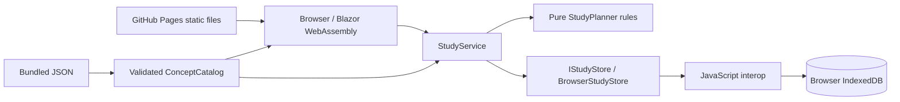

# Architecture and MVP specification

## Product scope

**Audience:** a .NET developer preparing for technical interviews, from early-career fundamentals through practical architecture discussions.

**Primary loop:** pick a concept, read its concise explanation and real-world example, answer a question, revisit mistakes, and see persistent progress. The dashboard prioritizes an unfinished lesson and surfaces weak topics. The learning experience starts at the study desk, not a marketing page.

**MVP:** six curriculum paths, 30 lessons, full/quick reading, search and filters, bookmarks, randomized quizzes, interview flashcards, spaced scheduling, browser-local progress, export, light/dark mode, desktop/mobile layouts, automated checks, and GitHub Pages deployment.

**Not in the MVP:** user accounts, cloud synchronization, editable content in the UI, live code execution, payments, administrator workflows, guaranteed interview readiness, or exhaustive coverage of every .NET API.

## Structure

A standalone Blazor WebAssembly application retains the C# UI and study rules while requiring only static hosting. The browser downloads the .NET runtime and executes the app locally. No application API, server circuit, database server, or authentication cookie is involved.

- `ConceptCatalog`: immutable-by-convention singleton content, validated at startup and searched in the browser. The six JSON sources are embedded as assembly resources.
- `StudyPlanner`: deterministic review, accuracy, weak-topic, and streak logic. It receives the current time rather than reading it internally.
- `StudyService`: validates concept/question/option IDs, grades answers in the browser, applies study rules, and retries optimistic storage conflicts up to eight times.
- `IStudyStore`: loads a detached document and conditionally commits a new version. `BrowserStudyStore` uses JavaScript interop; the rules tests use a detached in-memory implementation.
- `storage.js`: uses a native IndexedDB read/write transaction to compare the saved revision and replace the document atomically. Success is returned only when the transaction completes. Errors do not masquerade as successful saves.
- `StudyPageBase`: common async loading/saving state and safe user-facing failures. Exceptions are logged without displaying stack traces.
- `StudyJsonContext`: source-generated serialization for bundled lessons, stored progress, and export, compatible with the trimmed WebAssembly publish output.
- Small JavaScript helpers also handle Pages redirects, theme preference, clipboard access, downloads, and Prism invocation.

All lesson data, correct answers, and scoring logic are client-accessible. This is intentional for self-study; scores cannot be trusted as secure examination results.

## Browser storage

The IndexedDB database is named `fieldnotes:<base-path>`, version 1. It contains an object store named `study`, with a single `current` document. The database is already isolated by browser origin; including the base path avoids accidental collisions between repositories on the same GitHub Pages origin. This namespace is not a security boundary against other scripts on the same origin.

| Document field | Purpose | Data |
| --- | --- | --- |
| `schemaVersion` | Format compatibility | Unsupported versions are rejected without overwriting them |
| `revision` | Optimistic concurrency | Incremented for each successful document commit |
| `progress` | Per-concept state | Completion, bookmark, attempt/correct counts, review stage, last-study and next-review timestamps |
| `attempts` | Scored answers | GUID retry key, concept/question IDs, selected option, correctness, UTC timestamp |
| `activities` | Study history | Concept ID, activity kind, UTC timestamp |

Each mutation reads a fresh document, computes the change in C#, and commits only if the stored revision still matches. A conflicting tab update triggers a fresh read and retry. A replayed question attempt does not increase counters again. Existing tabs refresh their progress snapshot when navigating or performing an operation; there is no live cross-tab progress dashboard subscription.

No learner credentials are created. Clearing site data, switching browsers/origins/base paths, or storage eviction can make previous progress unavailable. Export downloads a JSON record without storage or retry identifiers; import and account recovery are not implemented. Earlier server-side SQLite files remain untouched and are not automatically migrated.

## Static routing

The build helper prepares the `base` element in both `index.html` and `404.html`, and writes `.nojekyll`. Internal links use that base; shared CSS icons use absolute URLs generated from it. The workflow obtains the real base path from `actions/configure-pages`, including root sites and custom domains.

GitHub Pages cannot rewrite arbitrary routes to a SPA entry point. A direct lesson URL first receives `404.html`, which redirects to the site's root with an encoded route parameter. `pages.js` restores the original path, query, and fragment before Blazor starts. Only same-origin routes within the configured base path are accepted. Unknown concepts render the app's not-found view; static hosting cannot provide server-computed HTTP statuses for application routes.

## Pages and contracts

| Route | Responsibility |
| --- | --- |
| `/` | Completion, accuracy, due count, streak, next lesson, paths, recent activity, recommendations |
| `/library` | Text search, track, difficulty, all/bookmarked/in-progress/completed filters |
| `/concept/{id}` | Full explanation, quick notes, two code excerpts, tradeoffs, interview answers, related concepts, completion and bookmark actions |
| `/practice` | Configure a 5/10/15-question session, grade each answer, show explanations and session summary |
| `/practice?concept={id}` | Focus on one concept; cap question count to available questions |
| `/revision` | Due, all, weak, or bookmarked interview flashcards; reveal and recall ratings |
| `/progress` | Accuracy, completion, UTC streak/activity, per-track results, weak topics, latest history |

Routes in this table are relative to the site's base path. Export is a button on the progress page that creates a local Blob download, not an HTTP endpoint. Operations expose loading/disabled/error states. Mobile navigation collapses to a menu. Code and wide progress tables scroll within their own regions.

## Learning semantics

- Reading records at most one `Read` activity per concept and UTC day, and updates last-study time. It does not complete the concept.
- Explicit completion schedules an initial next-day review if no schedule exists. Reopening a lesson does not erase its quiz or review history.
- Quiz attempts use a GUID idempotency key. Replaying the identical submission returns the stored outcome without changing counts; conflicting reuse is rejected.
- The review sequence is 1, 3, 7, 14, and 30 days, capped at 30 days. A wrong quiz answer or `Again` rating resets the stage and schedules 10 minutes later.
- Quiz answers and flashcard self-ratings both update review timing. Only scored quiz answers affect accuracy and weak-topic status.
- Weak means at least one attempt and unrounded accuracy below 70%. The UI rounds percentages for display.
- Streaks count distinct consecutive UTC activity days ending today or yesterday. Bookmarks and exports do not extend the streak.
- Deck entries are reviewed once per session. An `Again` card returns in a later due session rather than immediately looping in the current deck.
- The algorithm is a simple, documented interval heuristic. It is not an implementation of FSRS or a validated proficiency score.

## Themes

`theme.js` sets `data-theme` before styles render. System preference is the initial default; `fieldnotes.theme` in local storage records an explicit choice. The header control has an accessible action label and pressed state, and storage events synchronize tabs. If storage is blocked, the current page can still toggle themes without persistence.

Colors are shared through CSS variables and scoped component overrides. Dark mode preserves the same information hierarchy, question feedback, topic accents, and controls; it is not a color-inversion filter.

## Verification

- xUnit: scheduling cap/reset, completion distinction, streaks, accuracy, storage contracts, concurrent-write retry, duplicate quiz submission, storage errors, export, input rejection, flashcard scoring separation, read deduplication, and bundled catalog validity.
- Node: base-path generation, root/project Pages support, deep-link query/fragment round trips, and rejection of out-of-scope redirect targets.
- Playwright: a complete study session against published static files, IndexedDB persistence/isolation/concurrent tabs, simulated storage failures, actual export downloads, deep links, search, section navigation, mobile layouts, themes, and asset loading.
- CI: Release and hosting tests, static publication, browser checks, then deployment from the default branch. Pull requests cannot deploy. Screenshots and browser traces aid diagnosis; they do not replace manual accessibility review.

## Growth decisions

Optional accounts or cloud sync would require an external service; GitHub Pages cannot provide that backend. Preserve anonymous, browser-local study as the baseline. Before very large histories, consider individual IndexedDB records, aggregate queries, and paged history rather than rewriting one full document. Add validated import and explicit data deletion before promising recoverable local backups.

Keep new content in the catalog until authoring requirements justify an editor. Add projects or infrastructure abstractions when they enforce a demonstrated boundary, not simply to imitate a large enterprise template.